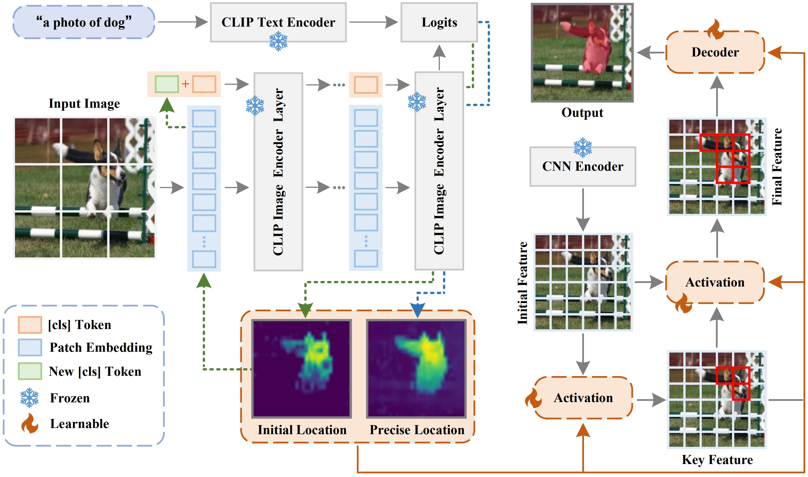

# Teaching CLIP to Localize at Pixel Level

📢Thanks for your interest in our work!

Jiaxiang Fang, Shiqiang Ma, Siyu Chen, Fei Guo, Shengfeng He

> **Abstract:** Large-scale Vision-Language Models like CLIP have demonstrated impressive open-set localization capabilities at the image level. However, adapting this capability to pixel-level dense prediction poses challenges due to global feature biases. In this paper, we introduce CLIPix, a simple yet effective framework that ‘teaches’ CLIP to perform pixel-level localization. By tracing back CLIP’s classification process, CLIPix identifies object-specific attentive regions and repurposes them as pixellevel localization cues. To address noise introduced by global biases, we propose a Noise-Resistant Self-Correction strategy, refining these cues for more precise segmentation. Additionally, we introduce a Localization Embedding strategy to integrate both localization and enriched detail information, enabling accurate, high-resolution segmentation. Our approach preserves CLIP’s generalization strength and unlocks its potential for segmenting arbitrary objects. Extensive experiments on the PASCAL and COCO datasets demonstrate that CLIPix achieves state-of-theart performance, underscoring its effectiveness.
   
## Installation

### 📘 Environment
   - python == 3.9.13

   - torch == 1.13.0

   - torchvision == 0.14.0 

   - cuda == 11.6

### 📝 Data preparation
Download the PASCAL-5i and COCO-20i datasets following  [HERE](https://github.com/juhongm999/hsnet).  

The ./datasets/ folder should have the following hierarchy:

    └── datasets/
        ├── VOC2012/            # PASCAL VOC2012 devkit
        │   ├── Annotations/
        │   ├── ImageSets/
        │   ├── ...
        │   ├── SegmentationClassAug/
        ├── COCO2014/           
        │   ├── annotations/
        │   │   ├── train2014/  # (dir.) training masks
        │   │   ├── val2014/    # (dir.) validation masks 
        │   │   └── ..some json files..
        │   ├── train2014/
        │   ├── val2014/
        

## 📚 References

This repository owes its existence to the exceptional contributions of other projects:

* DenseCLIP: https://github.com/raoyongming/DenseCLIP
* SAZS: https://github.com/Liuxinyv/SAZS?tab=readme-ov-file

Many thanks to their invaluable contributions.

